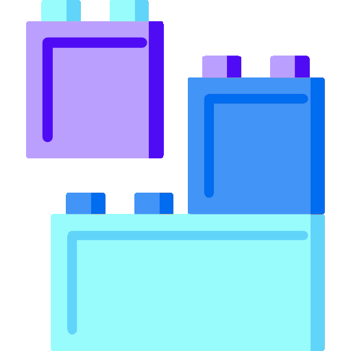
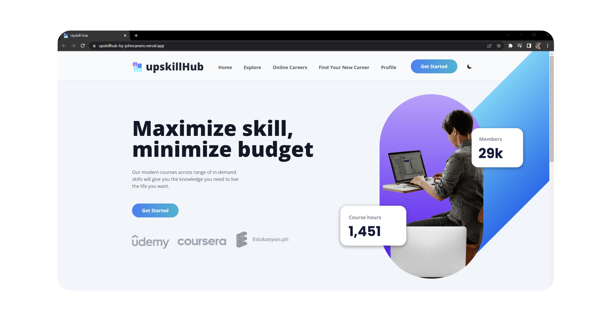
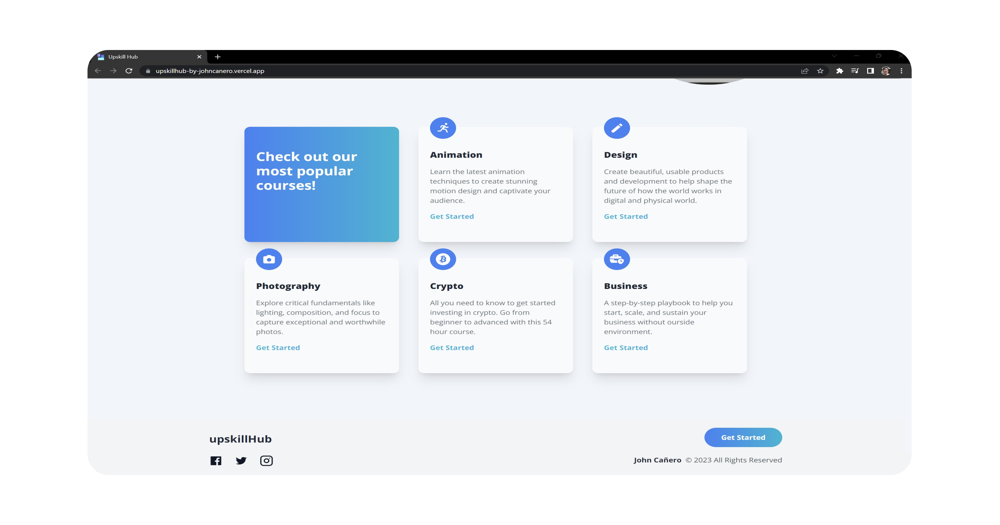
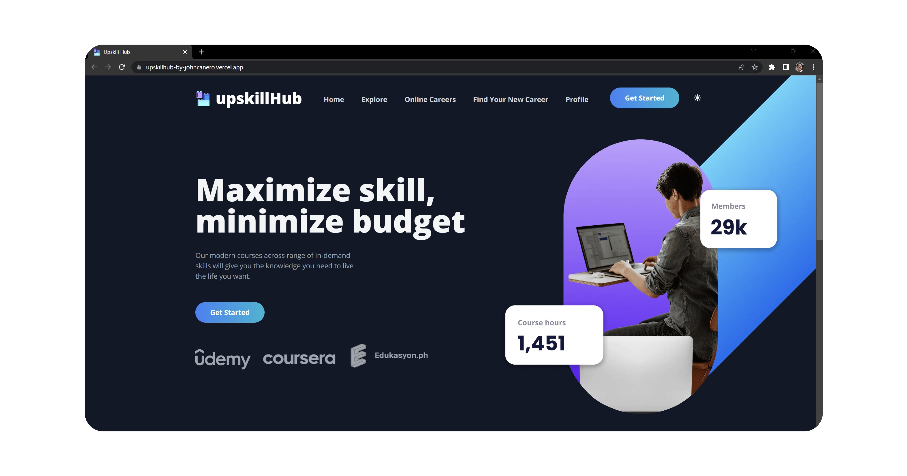
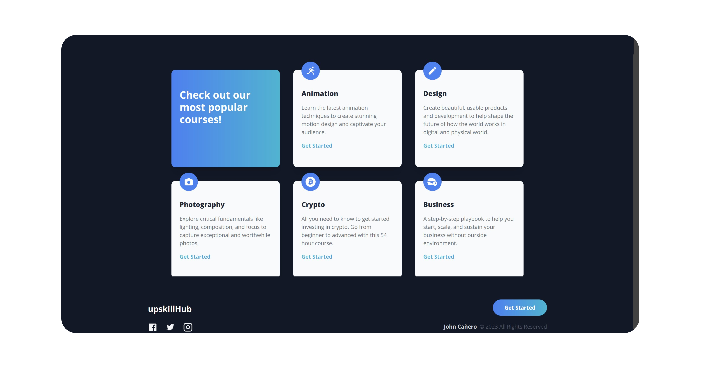
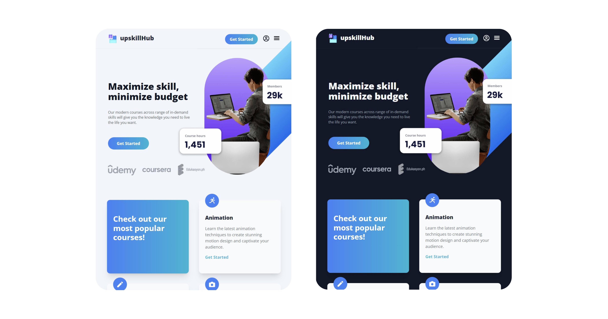
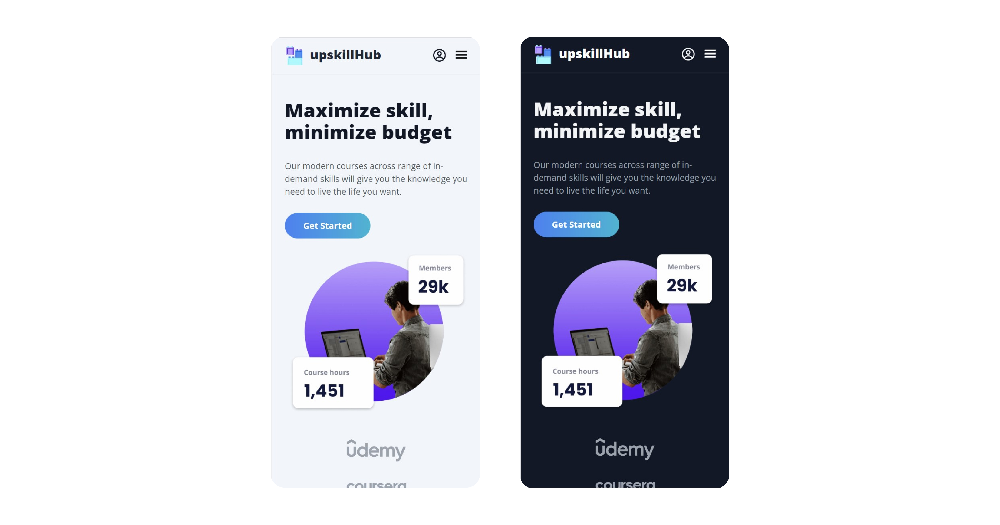

<!-- markdownlint-configure-file {
  "MD013": {
    "code_blocks": false,
    "tables": false
  },
  "MD033": false,
  "MD041": false
} -->

  

# Upskill Hub

Upskill Hub - an e-learning landing page website that is built to help
professionals upskill and advance their careers. 💡

The goal with Upskill Hub is to make it easy for individuals to find the training
they need to stay competitive in today's job market by offering a wide range of
online courses and resources from top industry experts. ⚪🔵

#elearning #elearningwebsite #onlineplatform #landingpage #development #education #learning #upskill #filipinos

## Website

🖥️ [https://upskillhub-by-johncanero.vercel.app/]

✍️ Project by John Cañero

## Responsive Design

🪟: [Desktop - Tablet - Mobile]

Desktop Responsive Light

Desktop Responsive Dark 

Tablet Responsive | Light and Dark

Mobile Responsive | Light and Dark

